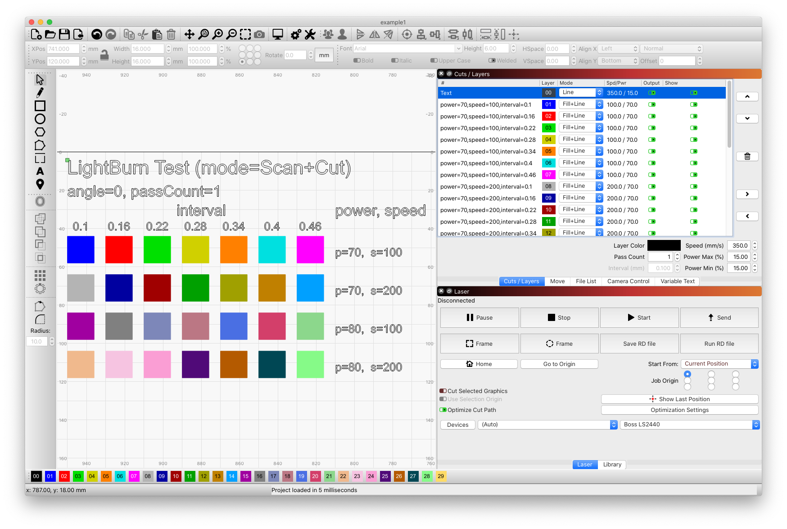

# lightburn-tester

A simple tool to generate setting combinations for [LightBurn](https://lightburnsoftware.com/),
a very neat laser-cutter software.

Can be used to check the output/result for various settings in one go.

See also [this nice web-based generator by Glenn Wilton](https://www.o2creative.co.nz/laser/lightburn_engrave_image_power_generator.php)

## Examples

* Test various power / speed / interval settings:
    ```
    ./lbt.py -f examples/example1.lbrn  power=70,80 speed=100,200 angle=0 passCount=1 -m Fill+Line interval=0.1-0.5@0.06
    ```
    Generated file: [example1.lbrn](examples/example1.lbrn).
    

* Test various angle / interval settings:
    ```
    ./lbt.py -f examples/example2.lbrn power=80 speed=100 interval=0.1,0.2,0.3,0.4 angle=0-90@15
    ```
    Generated file: [example2.lbrn](examples/example2.lbrn).
    
